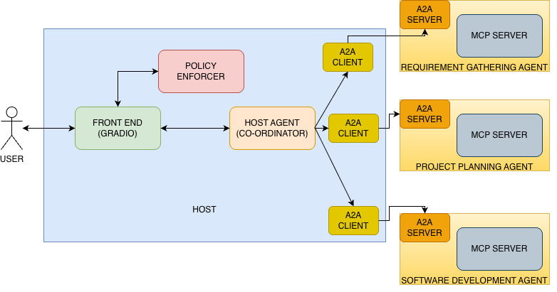
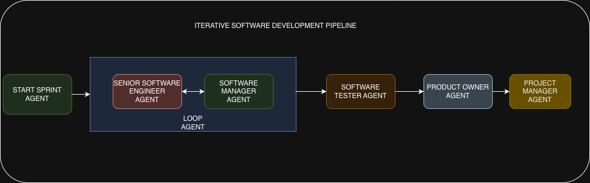
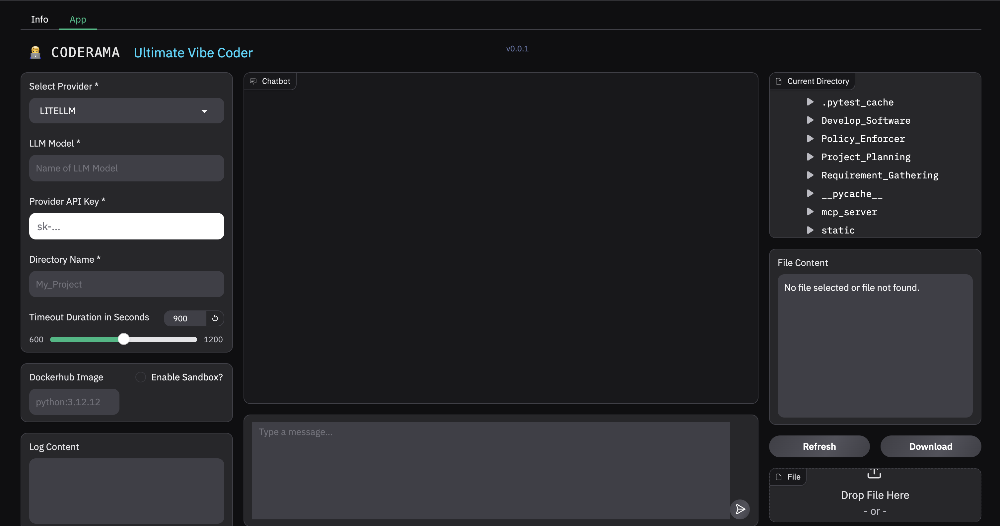

# CODERAMA

> *⚠️ DISCLAIMER: DO NOT TRY IN PRODUCTION. THIS DEMO IS INTENDED FOR DEMONSTRATION PURPOSES ONLY.*  
> *⚠️ Important: MCP and A2A protocols in action.*   


## Introduction  

This project highlights how an enterprise could implement software development lifecycle using Agents. It demonstrates 
the intricate working of a enterprise team where there might be different teams dealing with the entire software development lifecycle.For this project we have assumed three separate teams working to implement the application. These teams communicate via 
Agent2Agent (A2A) protocol. This simulates the scenario where each team can have different structure, policy, and could be using a different language internally.

These teams collaborate and seamlessly work together to accomplish a goal. Within a team they may use their internal tools to accomplish their task. These tools are exposed via a MCP server (FastMCP). Each team can have their own set of tools or use tools exposed via MCP that they need.

The project highlights the interoperability between A2A protocol and MCP protocol which serves very different purpose but can work together to achieve a goal.

## Architecture
The application features a software development pipeline with a host agent that routes requests to the appropriate specialized agent:

* **Host Agent** *(Python, Google ADK, A2A Python SDK)*: Acts as the central orchestrator for software development, dynamically determining which agent to send a request to based on the task at hand.
* **Requirement Gathering Agent** *(Python, Google ADK, A2A Python SDK, FASTMCP)*: Receives a high-level requirement from the user and creates a detailed content outline.Clarifies any questions with the user to get a detailed understanding of the business case and suggest appropriate recommendations for the goal. It does not assume anything and the high level detailed requirement has to be approved by the user before it is finalized.
* **Project Planning Agent** *(Python, Google ADK, A2A Python SDK, FASTMCP)*: Take the high level finalized requirement and converts it into managable `sprints`. This is necessary as we can track the progress better and not overwhelm our `Software Development Agent` with too much information.
* **Software Development Agent** *(Python, Google ADK, A2A Python SDK, FASTMCP)*: This is the agent that does the development of the software. It not only develops the software but also validates it and test it before approving it. It moves one `sprint` at a time. Once a sprint is approved by the user, only then it moves to the next `sprint`. This helps to keep the Human-In-The-Loop so they know the progress that is being made and can suggest any improvements while the development is done rather than at the end.

Apart from the above `agents` there is also a **Policy Enforcer** which acts as a guard between the user and the system. Anything that comes from the user and any response that goes to the user is sanitized by the `Policy Enforcer`. This is to ensure safety and compliance that is typical in a enterprise setting.

We have used a MCP server using `FASTMCP` server which uses `STDIO` protocol for communication. This module needs to be installed as a part of the installation process. `GRADIO` is used as the frontend to communicate with the system.

Logging is implemented for all the agents and the server. You can find the logs in the project execution directory named as `requirement_gathering.log` , `software_development.log` and `project_planning.log`. Currently the logging is at INFO level and you can find all the tool call, tool response and LLM response in the logs.

Once the project is complete the user can download it. It will all the instrctions to run the code along with the test cases.




The `software development agent` is a combination of multiple agents working together to achieve a goal, just like any enterprise software development team.Below is an architecture diagram of the same.  



## App UI




---

## Setup and Deployment

### Prerequisites

Before running the application locally, ensure you have the following installed:

1. **uv:** The Python package management tool used in this project. Follow the installation guide: [https://docs.astral.sh/uv/getting-started/installation/](https://docs.astral.sh/uv/getting-started/installation/)
2. **python 3.10** Python 3.10+ is required.
3. **Docker** Optional but highly recommended. 

### **Installation:**

```bash
# 1. Clone repository
git clone https://github.com/debasisdwivedy/Coderama.git
cd Coderama

# 2. Create virtual environment
uv venv --python 3.10

# 3. Activate environment
# Windows PowerShell:
.venv\Scripts\Activate.ps1
# Windows CMD:
.venv\Scripts\activate.bat
# macOS/Linux:
source .venv/bin/activate

# 4. Install dependencies
uv pip install -r requirements.txt

# 5. Run app
uv run .
```

An env file also can be created if not using UI as below:

```
PROVIDER="litellm" 																			#ONLY GOOGLE and LITELLM(for any other model) Supported
MODEL=""  																					#topenai/gpt-5-mini;ogether_ai/openai/gpt-oss-120b
GOOGLE_GENAI_USE_VERTEXAI=0
GOOGLE_API_KEY=""
GOOGLE_GENAI_USE_VERTEXAI="FALSE"
LITE_LLM_TOKEN=""
WORKSPACE_DIR = ""
DOCKER_IMAGE_TAG = "" 																		#arm64v8/python:3.12
PLATFORM = "" 																	 			# ONLY REQUIRED FOR ARM BASED PROCESSOR like 'linux/arm64'
TIMEOUT = '600' 																			# TIMEOUT in seconds.
REQUIREMENT_GATHERING_AGENT_URL = ""														# The remote Requirement Gathering agent URI : http://localhost:10001
PROJECT_PLANNER_AGENT_URL = "http://localhost:10002"										# The remote Project planning agent URI : http://localhost:10002
SOFTWARE_DEVELOPMENT_AGENT_URL = "http://localhost:10003"									# The remote Software Development agent URI : http://localhost:10003
LOGGING_LEVEL = "INFO"  																	# COULD BE INFO/DEBUG/ERROR. Default is INFO
SANDBOX_AVAILABLE = "TRUE" 																	# This referes to the availabilty of Docker in the host system to execute code.
```


### **Known Issues:**  
1. **TIMEOUT:** Currently the timeout is set to 900 secs by default. Sometimes a `sprint` may take longer than that. Please increase the timeout if the `agent` fails.  
2. **Sandbox env:** Sometimes `sandbox` environment can create some problems. If the project creation fails repeatedly for sandbox, turn it off.  
3. **OS:** Only Unix like operating system is natively supported.For windows please install `WSL` or run it in `sandbox` mode.  

### **Troubleshooting Tips:**  

Logs are created in the project folder for each agent `requirement_gathering.log` , `project_planning.log` and `software_development.log`. For details please refer to the logs.  


## 📜 **License**

MIT License - see [LICENSE](LICENSE) for details.

**TL;DR:** Free for personal, commercial, government use. Attribution appreciated but not required.

